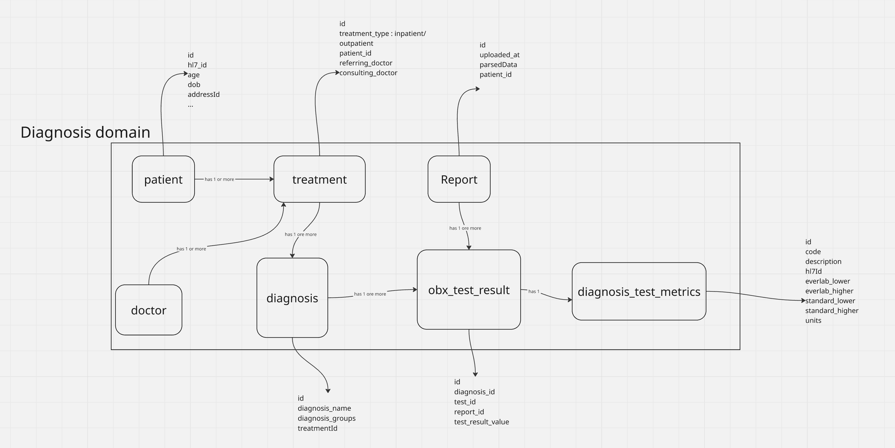
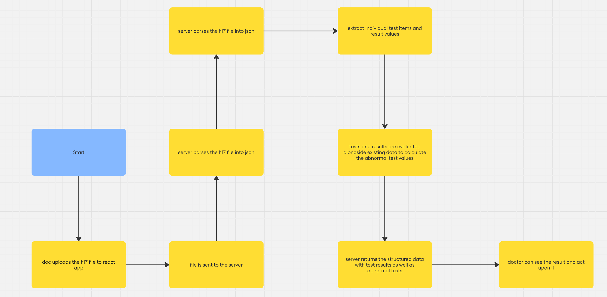

# LAB_SCREENING

1. I started by investigating how HL7 worked and the correlation between the metric CSV provided.
2. I researched freely available HL7 parsing libraries which would be useful during the upload process.
3. To better visualize the flow, I drew a simple flow diagram for the entire process. I will attach it below.
4. To understand the entity better, I brainstormed the entities that would be involved in the diagnosis domain. Some of the major entities are: patient, treatment, diagnosis, test_metrics, obx_test_result, and report.
5. I thought about what would be an appropriate architecture for this small project. I questioned: Do I need to push it to S3? If I upload directly to the server, would it bring the complication of a stateful server and require mounting an elastic file system in the server? How much time would implementing direct upload take? Should I run the file parsing and evaluation in a worker process and not block the server (maybe not with the given time)?
6. After thinking it through, I tried to strike a balance with the architecture of the application. There would be no complex WebSocket, no worker process for processing the uploaded file, and no S3 for the MVP. Instead, I uploaded and parsed the file in two different requests, which breaks down the big operation and also makes it fault-tolerant. If the file was uploaded successfully but parsing failed, the client can retry only the parsing part independently.
7. In the backend, I created a simple Express REST API server that exposes two endpoints: one for upload and another to get test_result.
8. Material ui was used to implement a clean design and quickly. In slow internet, the toast provides feed back to the doctor when file upload is complete and evaluation is in progress. The button label also changes when file upload is complete providing further feedback to the doctor. Test results were displayed in table with color coding for normal vs abnormal indicators.


diagram to show Domain Entities


diagram to show pictured flow

## Installation

Instructions on how to install and set up the project.

```bash
# Clone the repository
git clone git@github.com:shishirkaji/lab_screening.git
cd lab_screening

# Install dependencies for both client and backend
cd backend
npm install
cd ../client
npm install

# Start the backend server
cd ../backend
npm run dev

# Start the client application
cd ../client
npm run dev
```

You can use the file in `demoFiles` folder to upload hl7 doc.
